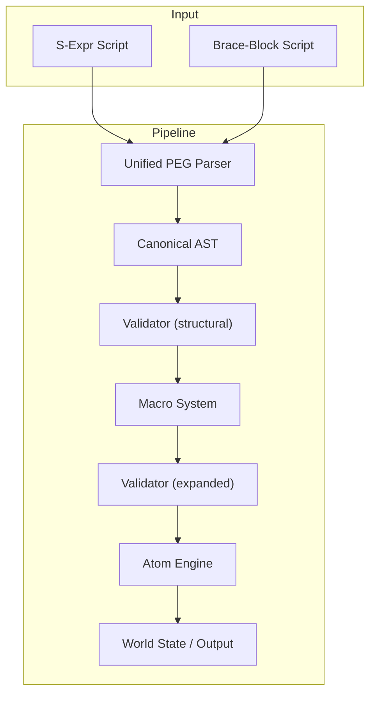

# Sutra Engine

Sutra is a universal substrate for compositional, emergent, and narrative-rich game systems. It is designed from the ground up to be minimal, transparent, and infinitely extensible, allowing designers to build everything from interactive fiction to deep simulations from a tiny, powerful core.

## Core Principles

-   **Purity & Immutability**: All operations are pure functions. State changes are handled through immutable data structures, eliminating side effects and simplifying debugging.
-   **Minimalism**: A tiny set of irreducible "atoms" form the core of the language. All higher-level constructs are built as macros.
-   **Compositionality**: Complex systems are built by composing simpler parts.
-   **Separation of Concerns**: The engine is strictly layered. Parsing, macro expansion, validation, and evaluation are completely decoupled.
-   **Single Source of Truth**: All game state is held in a single, persistent `World` object. All language syntax is defined in a single, formal PEG grammar.
-   **Transparency**: The entire pipeline is inspectable. Macro expansions can be traced, and state changes can be diffed.

## Engine Pipeline

Sutra processes code through a strict, sequential pipeline. This ensures that each stage is predictable, testable, and decoupled from the others.

1.  **Parsing**: Source code (in either s-expression or brace-block syntax) is parsed by a unified PEG parser into a canonical Abstract Syntax Tree (AST).
2.  **Validation (Structural)**: The initial AST is validated for correct structure.
3.  **Macro Expansion**: The AST is walked, and any macros are recursively expanded into more primitive forms.
4.  **Validation (Semantic)**: The expanded AST is validated to ensure it is semantically correct and uses only known atoms.
5.  **Evaluation**: The final, validated AST is evaluated against the current `World` state. Atoms are executed, producing a result and a new, updated `World` state.
6.  **Output**: Any output generated during evaluation (e.g., via a `print` atom) is emitted.

## Status

This project is currently in active development. The core data types, parser, and atom evaluator are complete. Work is underway on the macro expansion system.
