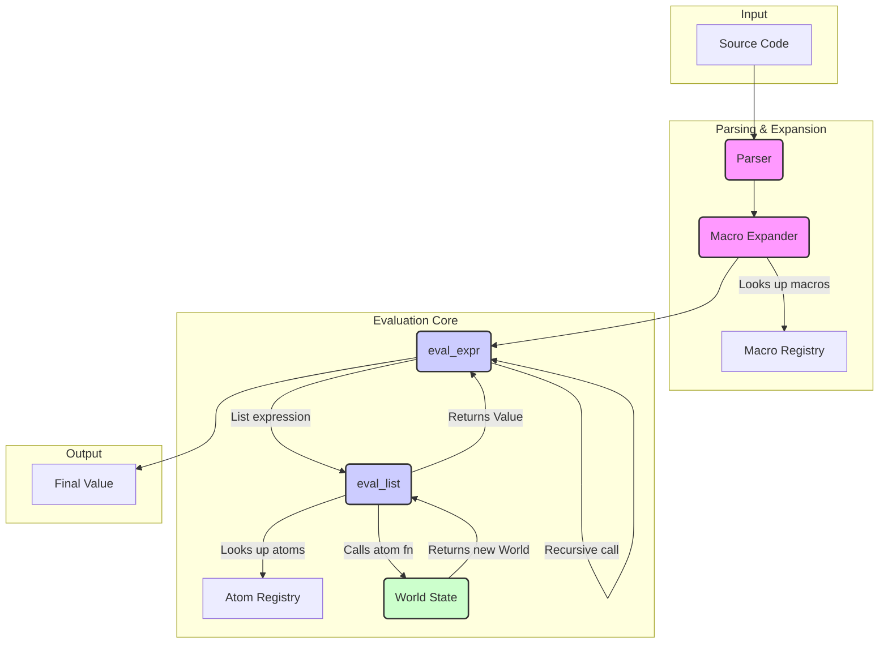

# Sutra Evaluation Engine: Architectural Analysis

This document provides a holistic architectural evaluation of the Sutra evaluation engine, identifying its primary components, evaluating its design against key architectural principles, and proposing strategies for improvement.

## 1. Architectural Diagram

The following diagram illustrates the flow of data and control through the major components of the Sutra evaluation pipeline, from source code parsing to final value resolution.

## 2. Evaluation of Architectural Principles

### 2.1. Coupling & Cohesion

- **High Cohesion (within modules):** Modules like `atoms`, `macros`, and `runtime` exhibit high cohesion. For example, `src/atoms/math.rs` contains only mathematical operations, and `src/runtime/world.rs` is focused exclusively on state management. This makes the modules easy to understand and maintain.
- **Loose Coupling (between major components):** The Parser, Macro Expander, and Evaluator are loosely coupled. The Parser produces an AST, the Expander transforms it, and the Evaluator consumes it. They interact through well-defined data structures (`AstNode`, `MacroEnv`), not direct calls.
- **Moderate Coupling (within the runtime):** `eval_expr` and `eval_list` are moderately coupled. `eval_expr` delegates to `eval_list` for list evaluation, creating a dependency. While necessary, this coupling could be reduced if `eval_list` were a more generic function call handler.
- **Tight Coupling (to `World`):** The `World` state is passed through nearly every evaluation function. While this is an explicit and functional approach, it creates a high degree of coupling. Any change to the `World` structure could have cascading effects.

### 2.2. Encapsulation

- **Strong Encapsulation (`World`):** The `World` state is well-encapsulated. Its internal `HashMap` is private, and all interactions are mediated through public methods like `get`, `set`, and `del`. This protects the integrity of the state.
- **Good Encapsulation (`AtomRegistry`, `MacroRegistry`):** Both registries hide their internal storage and expose clear, public APIs for registration and lookup.
- **Weak Encapsulation (in `eval_expr`):** The `eval_expr` function is a large `match` statement that knows about every `Expr` variant. This is a classic pattern that violates encapsulation; adding a new expression type requires modifying this central function.

### 2.3. Single Responsibility Principle (SRP)

- **Good Adherence (at module level):** Most modules adhere to SRP. `src/syntax/parser.rs` only parses, `src/macros/expander.rs` only expands macros, and `src/runtime/eval.rs` only evaluates.
- **Violation (in `eval_expr`):** The `eval_expr` function violates SRP. It is responsible for:
    1.  Recursion depth checking.
    2.  Dispatching to `eval_list`, `eval_if`, etc.
    3.  Handling literal values.
    4.  Resolving symbols (in a basic way).
    This makes the function complex and difficult to reason about.
- **Violation (in Atoms):** Some atoms have implicit dependencies on the `eval_expr` function via helpers like `eval_args`. This blurs the line between primitive operations and the evaluation engine itself.

### 2.4. Contracts

- **Explicit Contracts (Atoms):** The `AtomFn` type signature `fn(&[AstNode], &mut EvalContext, &Span) -> AtomResult` serves as a clear, explicit contract for all primitive operations. This is a major strength of the architecture.
- **Implicit Contracts (Evaluation Functions):** The contracts between `eval_expr`, `eval_list`, and their helpers are implicit. They rely on conventions (e.g., how `World` is threaded) rather than explicit interfaces.
- **Well-Defined Data Contracts:** The `AstNode` and `Value` enums serve as well-defined data contracts that are respected across the parsing, expansion, and evaluation stages.

## 3. Primary Architectural Flaws

Based on the principles of pragmatic minimalism, the following architectural weaknesses have been identified. These flaws increase complexity, reduce maintainability, and create a fragile system where changes can have unintended consequences.

### 3.1. Centralized Complexity in `eval_expr`

The `eval_expr` function is a monolithic component that violates the Single Responsibility Principle. Its responsibilities include:

-   **Recursive Dispatch:** It manages the recursive evaluation of nested expressions.
-   **Type Switching:** It contains a large `match` statement to handle every `Expr` variant.
-   **State Management:** It is responsible for threading the `World` state through all evaluations.

This centralization creates a bottleneck for development and a high-risk area for bugs. A change to any part of the evaluation logic requires modifying this single, complex function, which goes against the principle of modularity.

### 3.2. Implicit Dependencies and Blurry Boundaries

There is a subtle but significant coupling between the "pure" `atoms` and the evaluation engine. Helper functions like `eval_args` in `src/atoms/helpers.rs` directly call `eval_expr`, creating a circular dependency:

1.  `eval_expr` calls an `atom`.
2.  The `atom` calls `eval_args`.
3.  `eval_args` calls `eval_expr` again to evaluate arguments.

This makes it difficult to reason about the system in isolated parts. Atoms are not truly primitive if they have implicit knowledge of the evaluation engine. This design violates the principle of low coupling and makes the system harder to test and refactor.

### 3.3. Fragile State Management

While the `World` state is well-encapsulated, its state is passed through every level of the evaluation stack. This "state threading" creates a high degree of coupling to the `World` object. Any modification to how state is managed (e.g., adding transactional capabilities, improving performance) would require changes throughout the entire evaluation pipeline.

This approach is fragile because it exposes the entire `World` to every component, even if that component only needs to read a single value. A more robust design would provide more limited, purpose-built interfaces to the state.

## 4. Proposed Solutions & Refactoring Strategies

To address the identified flaws, the following high-level principles and refactoring strategies are proposed. These changes are designed to increase modularity, reduce complexity, and create a more robust and maintainable system, in line with the philosophy of pragmatic minimalism.

### 4.1. Decouple Atoms from the Evaluator

The most critical refactoring is to break the implicit dependency between atoms and the evaluation engine.

-   **Principle:** Atoms must be pure, primitive operations that do not have knowledge of the evaluation context. They should operate on `Value` types, not `AstNode`s.
-   **Strategy:**
    1.  **Pre-evaluate Arguments:** The `eval_list` function (or a new `call_atom` function) should be responsible for evaluating all arguments *before* passing them to the atom.
    2.  **Modify Atom Signature:** The `AtomFn` signature should be changed to accept a `Vec<Value>` instead of `&[AstNode]`. The `EvalContext` can be simplified or replaced with a more limited interface to the `World`.
    3.  **Eliminate `eval_args`:** The `eval_args` helper and its variants in `src/atoms/helpers.rs` must be removed.

-   **Justification:** This change enforces a strict boundary between evaluation and primitive operations. Atoms become truly self-contained and easier to test. The evaluation engine's responsibility becomes clearer, and the circular dependency is eliminated, which is a core tenet of pragmatic minimalism.

### 4.2. Introduce a "Callable" Trait

To break down the monolithic `eval_expr` function, we can introduce a `Callable` trait that abstracts the concept of an invokable entity.

-   **Principle:** Any object that can be invoked (atoms, macros, functions) should be treated polymorphically.
-   **Strategy:**
    1.  **Create a `Callable` Trait:** Define a trait with a single `call` method that takes arguments and a context.
    2.  **Implement for Atoms and Macros:** Implement the `Callable` trait for `AtomFn` and `MacroDef`.
    3.  **Refactor `eval_list`:** The `eval_list` function would no longer resolve symbols to atoms. Instead, it would resolve a symbol to a `Box<dyn Callable>` and invoke its `call` method.

-   **Justification:** This approach aligns with the open/closed principle. To add a new invokable type, you would implement the `Callable` trait, rather than modifying the `eval_expr` `match` statement. This reduces the complexity of the core evaluator and improves modularity.

### 4.3. Isolate World Interactions with a "Context" Facade

Instead of passing the entire `World` object through the evaluation stack, we can introduce a more limited `Context` facade that exposes only the necessary state management functions.

-   **Principle:** Components should only have access to the state they absolutely need.
-   **Strategy:**
    1.  **Define a `Context` Trait:** Create a trait that defines the minimal interface required for state interaction (e.g., `get_value`, `set_value`).
    2.  **Implement for `World`:** The `World` object would implement this trait.
    3.  **Pass `&mut dyn Context`:** Evaluation functions and atoms would receive a mutable reference to the `Context` trait object, not the concrete `World`.

-   **Justification:** This is a classic facade pattern that decouples the evaluation engine from the concrete implementation of the `World`. It makes the system more robust to changes in state management and improves testability, as mock `Context` objects can be easily created. This adheres to the principle of minimal, stable interfaces.
