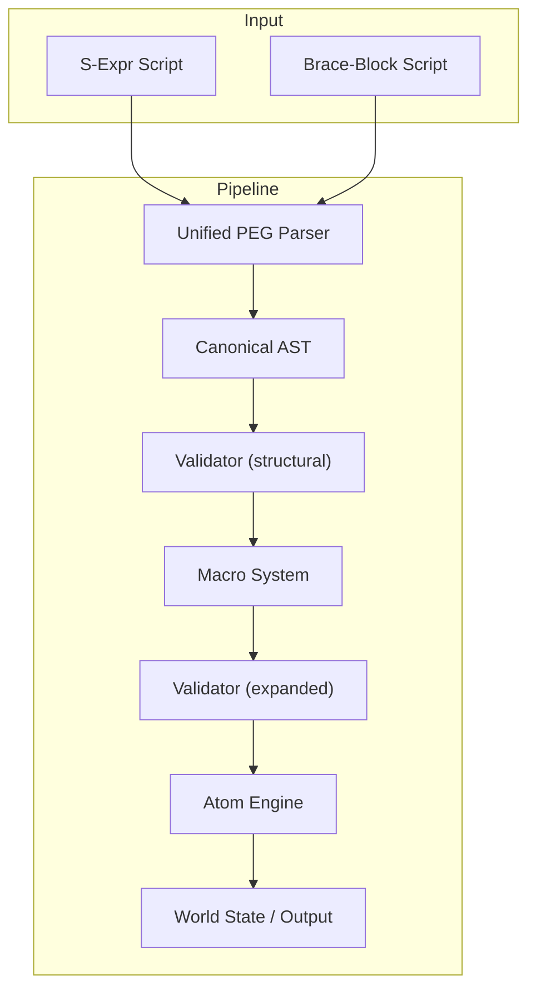

# **Sutra Engine Staged Implementation Plan (Refined)**

_Last Updated: 2025-07-01_

---

## **Stage 0: Project & Philosophy Bootstrapping (COMPLETED)**

- **0.1:** **(✓)** Reaffirm guiding principles: **purity, immutability, minimalism, separation of concerns, compositionality, single source of truth, maximal testability**.
  - **(✓)** **Improvement:** Write a README/code comment with principles and pipeline summary at repo root.
- **0.2:** **(✓)** Init project with CI/test harness and a “failing” test for the pipeline (TDD from the start).
- **0.3:** **(✓)** Scaffold a “core” crate/library—no coupling to IO or CLI yet.

---

## **Stage 1: Canonical AST and Data Types (COMPLETED)**

- **1.1:** **(✓)** Define `Expr` enum (S-expression node: List, Symbol, String, Number, Bool).
- **1.2:** **(✓)** Define `Value` (data: Number, String, Bool, List, Map, etc.)—make sure it’s _deeply_ cloneable or persistent for pure state transitions.
- **1.3:** **(✓)** Define `World` as a deeply immutable persistent map (consider `im::HashMap` or similar).
  - **(✓)** **Potential flaw:** Avoid custom “object” systems or non-uniform data. Keep World as “just data”—no methods beyond structural ops.
- **1.4:** **(✓)** Serialization/debug formatting for AST and World (useful immediately for tests).

---

## **Stage 2: Canonical PEG Parser (COMPLETED)**

- **2.1:** **(✓)** Implement a robust parser for the canonical s-expression and brace-block syntaxes **using a formal PEG (Parsing Expression Grammar)**.
  - **(✓)** The grammar is now defined in `src/sutra.pest`, serving as the single source of truth for all supported syntaxes.
  - **(✓)** The implementation now uses the `pest` parser generator library for maximum maintainability and superior error reporting.
- **2.2:** **(✓)** Robust error reporting with precise span information derived directly from the PEG parser is implemented.
- **2.3:** **(✓)** Unit/golden tests for the parser covering both s-expression and brace-block inputs, including edge cases.
- **Principle:** This approach unifies all parsing logic, ensuring consistency and long-term maintainability.

---

## **Stage 3: Atom Engine / Evaluator (COMPLETED)**

- **3.1:** **(✓)** Implement atom evaluation. The `AtomFn` signature is now `(args, context, parent_span) -> Result<(Value, World), SutraError>` to support enhanced error reporting.
- **3.2:** **(✓)** Implement full Tier 1 atom set: `set!`, `del!`, `get`, `+`, `-`, `*`, `/`, `eq?`, `gt?`, `lt?`, `not`, `cond`, `list`, `len`.
- **3.3:** **(✓)** Immutably update World on every mutation; track all randomness via explicit PRNG in World.
- **3.4:** **(✓)** Make `print` atom an injectable callback, not hardwired to IO—this maximizes compositionality and testability.
- **3.5:** **(✓)** Unit tests for each atom; golden tests for evaluation scenarios.
  - **(✓)** **Flaw to avoid:** Don’t allow atoms to “cheat” by mutating data outside World; ensure all change flows through World and explicit returns.
- **(✓)** **Optimization:** Structure the evaluator as a pure, tail-call optimized loop (for future unbounded recursion/macro loops).
- **Note:** The "auto-get" feature, originally planned and implemented here, has been **refactored and moved to Stage 4**. The evaluator now rejects bare symbols.

---

## **Stage 4: Macro System (Expansion Only) (IN PROGRESS)**

- **4.1:** **(✓)** Implement pattern-matching macro expansion engine in `src/macros.rs` (renamed from `macro.rs`).
- **4.2:** **(✓)** Implement macro-based "auto-get" feature.
  - **(✓)** Standard macros (`is?`, `add!`, etc.) in `src/macros_std.rs` now use a `wrap_in_get` helper to transform bare symbols into explicit `(get ...)` calls.
  - **(✓)** This makes macro expansion the sole owner of symbol resolution, simplifying the evaluator.
- **4.3:** **(✓)** Macro expansion is **purely syntactic:** AST-in, AST-out—never touch World.
- **4.3a:** **(✓)** Macro path canonicalization is now strictly enforced: all macro-generated atom path arguments are canonicalized at expansion time, using a single helper (`canonicalize_path`).
  - **(✓)** Comprehensive tests enforce the contract; all macro/atom integration tests pass except for a single unrelated world state propagation issue.
- **4.4:** **(Next)** Macro hygiene: name hygiene for locals, recursion limits to avoid runaway expansions.
- **4.5:** **(✓)** Provide debug tracing for macroexpansion (author-inspectable at any step).
- **4.6:** **(Next)** Write and test all standard macros (storylet, choice, etc.) as macros, not as atoms or engine logic.
  - **Flaw to avoid:** Never let macro code “sneak” into atom engine—keep macro system and atoms fully layered.
- **4.7:** **(✓)** Macroexpand “explain” CLI/test tool for authors (implemented as `macrotrace` command).
- **Improvement:** Macro system should be generic: treat author, system, or future user macros identically (no “privileged” macros).

---

## **Stage 5: Validation and Author Feedback (IN PROGRESS)**

- **5.1:** **(Next)** Validation functions:
  - Structural validation: malformed AST, missing macro fields, etc.
  - Semantic validation: type mismatches, duplicate definitions, etc.
- **5.2:** **(Next)** Integrate validation **before** macro expansion (parse-time) and **after** (expanded form).
- **5.3:** **(✓)** Author-centric error reporting—The foundational `EvalError` system provides rich, contextual errors. This will be the model for validation errors.
  - **Optimization:** Validation should be functional and stateless; emit all errors found, don’t stop at first.
- **Principle:** Keep validator in its own crate/module; don’t couple to macro or atom implementations.

---

## **Stage 6: Test Harness and CLI (IN PROGRESS)**

- **6.1:** **(✓)** Build a professional CLI to run scripts, macroexpand, etc. A new `src/cli` module now exists, using `clap`.
- **6.2:** **(✓)** Provide macroexpansion traces for every test. The `macrotrace` command is implemented. The test harness in `tests/core_eval_tests.rs` has been updated to show how to use this on failure.
  - **Flaw to avoid:** Don’t let CLI code pollute engine—engine is library-first.
- **Improvement:** Add a `ScriptTest` trait or similar to easily compose test scripts, macroexpansion checks, and golden output.

---

## **Stage 7: History, Pools, and Selection (Macro Layer)**

- **7.1:** Implement “history” tracking (seen events), pool selection, weighted/random selection as macros or as atom extensions (if truly irreducible).
- **7.2:** Test against QBN, storylet, and pool selection patterns from design docs.
- **7.3:** Document these as canonical usage patterns; provide macroexpansion for all.
- **Optimization:** Make sure no part of “storylet selection” is privileged—macro-driven all the way.

---

## **Stage 8: Documentation and Example Library**

- **8.1:** Inline docstrings, macro signatures, and usage examples in code.
- **8.2:** Minimal Markdown/README explaining system pipeline, principles, extension, and debugging.
- **8.3:** Canonical example scripts and golden test suite.

---

## **Stage 9: (After MVP) Brace-Block DSL Translator (MERGED INTO STAGE 2)**

- **Note:** The implementation of the brace-block translator has been unified with the s-expression parser in Stage 2 under a single PEG-based system. This ensures a single source of truth for all syntax and consistent error handling. All work for this stage is now tracked under Stage 2.

---

## **Stage 10: Continuous Iteration, Macro Growth, and Future-proofing**

- **10.1:** Harden macro expansion (user macros, modules, hygiene, error explain).
- **10.2:** Refactor atom set if any new irreducible ops arise from real macro/authoring pain.
- **10.3:** Add advanced macro features (grammar/templating, agent simulation) only if needed, and only as macros unless proven otherwise.
- **10.4:** Plan for future UI, editor, or online integration.

---

## **Improvements and Checks vs. Principles**

- **Pipeline is strictly layered and functional:** All stages are pure, pass data, and never cross layers.
- **All code is testable, inspectable, and debuggable at every stage.**
- **No privileged “magic” in atoms or macro system; everything is author-explorable.**
- **Validation and error reporting prioritized early, not deferred to “cleanup.”**
- **World state is a single, persistent tree—no leaking state, no accidental mutation.**
- **No dependencies between surface syntax and the core—engine can run on canonical s-expr only.**
- **Macro and atom sets evolve only through test-driven, documented need—never preemptively.**
- **All author-facing language constructs (storylet, pool, etc.) are implemented as macros.**

---

## **Pipeline Visualization (Updated)**

---

## **Potential Flaws/Oversights to Avoid**

- Do **not** entangle CLI/IO with any engine layer (library-first, always).
- Do **not** let macro or atom sets become “fat” with rarely used or duplicate functionality.
- Avoid “quick hacks” for authoring pain points—always macroize first, then promote to atom only if necessary.
- Do **not** build in assumptions about pool structures, thread patterns, or “standard” game data; keep the engine truly generic.
- Do **not** “leak” validation, macro, or parsing logic into the World state or evaluation loop.
- **Document everything** as you go; treat the engine as a model for other projects.

---
